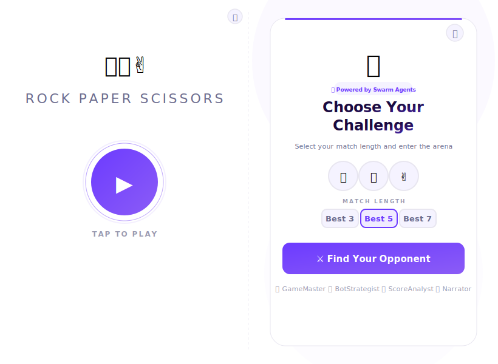

# 🎮 Rock Paper Scissors — Swarm Arena

An interactive Rock Paper Scissors game with a **white minimal home page**, **mode selection screen**, **4 AI swarm agents**, immersive sound effects, countdown animations, and best-of-3/5/7 tournament mode.




## ✨ Features

### 🧠 Swarm AI Agents
- **BotStrategist** — Analyzes your patterns and selects counter-moves
- **GameMaster** — Orchestrates game flow, validates moves, manages state
- **ScoreAnalyst** — Tracks real-time statistics & predictions
- **Narrator** — Provides engaging thematic commentary

### 🎮 Game Features
- **White Minimal Home Page** — Centered Play button with animated glow
- **Mode Selection** — Choose your challenge before entering the arena
- **Best of 3 / 5 / 7** — Select your tournament length
- **Dramatic Countdown** — "Rock… Paper… Scissors… SHOOT!" with shaking hands
- **Sound Effects** — Web Audio API chimes for countdown, win, lose, draw, victory
- **Visual Feedback** — Glowing win/lose/draw effects with color-coded borders
- **Round Progress Dots** — Green/red/amber indicators for each round
- **Strategy Reveal** — See which bot strategy was used after each round
- **Results Screen** — Final score, win/loss/draw stats, ScoreAnalyst report
- **Confetti 🎉** — Colorful burst on victory with sparkle sounds
- **Swarm Insights Panel** — Real-time agent activity feed
- **Keyboard Shortcuts** — `1` Rock, `2` Paper, `3` Scissors, `Enter` to continue, `Escape` for home
- **Responsive** — Works on desktop and mobile

## 🎯 How to Play

1. Tap the **Play** button (▶) on the white home screen
2. Select **Best of 3, 5, or 7** on the mode selection screen
3. Click **⚔️ Find Your Opponent** (or press `Enter`)
4. Watch the 4 swarm agents activate with sound effects
5. Pick your throw: **Rock** (`1`), **Paper** (`2`), or **Scissors** (`3`)
6. Watch the countdown animation and see who wins the round
7. See the bot's strategy revealed after each round
8. Click **Next Round** (`Enter`) to continue
9. After the match, view your stats and ScoreAnalyst report
10. Play Again or return to Home

## ⌨️ Keyboard Shortcuts

| Key | Action |
|---|---|
| `Enter` | Play / Start Game / Next Round / Play Again |
| `1` | Rock ✊ |
| `2` | Paper ✋ |
| `3` | Scissors ✌️ |
| `Escape` | Return to home (from results) |

## 🛠️ Tech Stack

- **Frontend**: Pure HTML, CSS, JavaScript — no dependencies
- **Backend**: Python HTTP server with SSE event streaming
- **Swarm AI**: 4-agent orchestrator system for game logic
- **Audio**: Web Audio API for synthesized sound effects
- **Animations**: CSS keyframes for smooth transitions

## 🚀 Usage

### Quick Play (Frontend only)
Open `rps_app.html` in any modern browser — no server needed.

### Full Experience (with Swarm Backend)
```bash
python rps_server.py
# Open http://localhost:8000
```

The backend enables the SSE stream for the Swarm Insights panel and provides API endpoints for agent orchestration.

## 📁 Files

| File | Description |
|---|---|
| `rps_app.html` | Game frontend (standalone single HTML file) |
| `rps_swarm.py` | Python swarm AI agent system |
| `rps_server.py` | HTTP server with SSE streaming |
| `rps_screenshot.svg` | Game screenshot |
| `screenshot_results.svg` | Results screen screenshot |

---

Built with ❤️ by [MuhammadAwais047](https://github.com/MuhammadAwais047)
